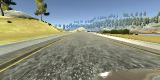

# Behavioral Cloning for Self-Driving Cars

The goal of this project is to train a convolutional neural network to map the front-facing camera directly to the steering commands. With the training model, the system can drive a car autonomously around test tracks in the Udacity's driving simulator.

Here are two youtube videos that the self-driving cars ran under two anmiated roads from the simulation tool

|  |  |
|---|---|
|[Road Track one - Youtube](https://youtu.be/L6MeuvmfgOM)|[Road Track two (hard one) - Youtube](https://youtu.be/MueOlce4iXw) |

## Simulator Download
Linux
macOS
Windows

## Files and Usage

# Implementation Deep Dive

## Data Collection
The train data is collected by driving the car in the simulator. Each car equiped with three front-faceing cameras: left, center, and right positioned, to capture the images as below in real time. The car was driven in the center of the road as much as possible during the training process, although in the real world the car should stay in its own lane. For the simplicity of this project, it only aims for the center road driving.

## Network Architecture
I used Nvidia's architecture from their white paper [End to End Learning for Self-Driving Cars](https://arxiv.org/pdf/1604.07316.pdf). It contains 9 layers, 1 normalization layer, 5 convolutional layers, and 3 fully connected layers. 

From bottom up, below is each layer's funcationalities

| Layer | Type | Description |
| :---: | :---: | --- |
| Input |  | 1) 160x320 images   2) Normalize the pixel value to [-1, 1] range   3) Chop the top and bottom portion of the images to remove noices |
| Layer 1 | Conv2D | 24 filters with 5x5 convolution window and 2x2 strides |
| Layer 2 | Conv2D | 36 filters with 5x5 convolution window and 2x2 strides |
| Layer 3 | Conv2D | 48 filters with 5x5 convolution window and 2x2 strides |
| Layer 4 | Conv2D | 64 filters with 3x3 convolution window and 1x1 strides |
| Layer 5 | Conv2D | 64 filters with 3x3 convolution window and 1x1 strides |
| Layer 6 | Fully connected | 1) 50% dropout   2) Output 100 neurons |
| Layer 7 | Fully connected | 1) 50% dropout   2) Output 50 neurons |
| Layer 8 | Fully connected | Output 10 neurons |
| Layer 9 | Fully connected | Output 1 neurons |

The left deep neural network architecure used from [NVidia’s paper](https://arxiv.org/pdf/1604.07316.pdf). The right is the screen shot from Keras model.summary() call.

## Training Details

For each road in the simulator, I driven the cars for two cycles to collect the images, steering, throttle, brake, and speed information. 

### Leverage left and right camera images

he left and right images are important to teach the network how to recover from a poor position. The center image represents the direction that the car go straight, and the left / right images records the direction if the car steer left or right on a certain angle. Since the distance and angle are not given for the left and right camera in the simulator, an empiricial approach is applied: adding an offset of 0.25 to the left images and substracting 0.25 from the right images. This is intend to steer the car back to the view of the center camera, if the center camera faces what the left / right cameras see.

### Data Augmentation through fliping images

Data augementation can be acheived through flipping images and taking the opposite sign of the steering measurement. This only only introduces more training data, but also minimizes the left turn bias because in the simulator the steering left dominates in the road condition

### Prevent overfitting

To prevent overfitting, both dropout and L2 regulaization are used. 50% dropout has applied to the first two fully connected layers, while the L2 regulaization has appiled to conv2D and fully connected layers.

### Extra road training

The first simulator road is smooth with few sharp turn, and so I only need to drive the car for a couple cycle to complete the training. The result works pretty well. However, the second simulator road is a lot harder, not only with sharp turns, but also multiple roads in the same images and thus making the model confused on which one is the right path.

## Evaluation

